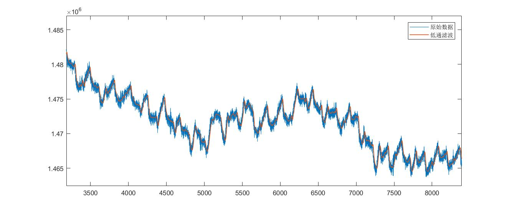

# KISS FIR

### 介绍：

KISS FIR 是一个特别容易使用、嵌入式友好的通用实时FIR滤波器(Finite Impulse Response Filter)。

此代码实现了<u>Hamming</u>和<u>Blackman</u>两种窗函数下的低通、高通、带通、带阻滤波器。相信我，你绝对没见过如此简单的代码，以至于我觉得没必要写注释。

### 使用：

```c
#include <stdio.h>
#include "kiss-fir.h"

int main()
{
    float in, out;
    fir_t *fir20 = create_low_pass_fir(20, 5, 100, HAMMING);
    FILE *fp = fopen("./data.txt", "r");
    FILE *fp_out = fopen("./data_out.txt", "w+");

    while (!feof(fp))
    {
        fscanf(fp, "%f", &in);
        out = fir_filter(fir20, in);
        fprintf(fp_out, "%f\n", out);
    }

    fclose(fp);
    fclose(fp_out);
    fir_free(fir20);
    return 0;
}
```

1、通过`create_low_pass_fir(20, 5, 100, HAMMING)`创建一个20阶、采样频率为100Hz，截止频率为5Hz的低通滤波器，`create_low_pass_fir`会返回滤波系数以及滤波所需的空间，如果遇到异常，则会返回NULL

2、通过`fir_filter(fir20, in)`对数据进行滤波，滤波结果通过函数返回

3、滤波完成后，通过`fir_free(fir20)`释放滤波分配的空间

##### 低通滤波结果如下：




### LICENSE

遵循MIT开源